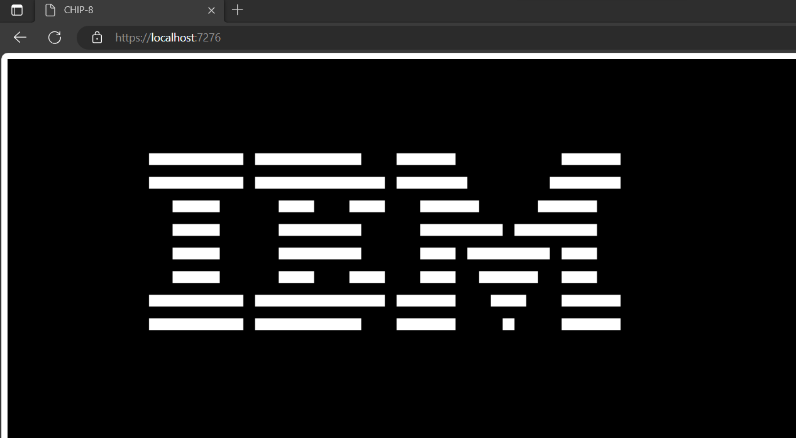

Check out this [blog post](https://blog-gr10bw05z-andrewjhopkins.vercel.app/posts/chip-8) for details on implementation

# CHIP-8
An implementation of the [CHIP-8 spec](http://devernay.free.fr/hacks/chip8/C8TECH10.HTM#font) using C# and Blazor. More information on CHIP-8 [here](https://en.wikipedia.org/wiki/CHIP-8)

I wrote this to better understand how emulators work as well as gain more experience with binary and hexadecimal. 
*Most likely not bug free.*

### Dependencies
- [.NET 7](https://dotnet.microsoft.com/en-us/download/dotnet/7.0)
- [Blazor](https://dotnet.microsoft.com/en-us/apps/aspnet/web-apps/blazor)
- [Blazorex 1.0.2](https://www.nuget.org/packages/Blazorex/)

### Running
- clone the repository
- In Index.razor specify the scale, speed and update the path in GetRomData to point to the ROM you would like to run. 
    - Be sure the localhost port is correct for your local environment as this changes.
- Run in Visual Studio 2022 or using dotnet run with the dotnet CLI

### References
- [CHIP-8 Wikipedia](https://en.wikipedia.org/wiki/CHIP-8)
- [CHIP-8 SPEC](http://devernay.free.fr/hacks/chip8/C8TECH10.HTM#font)
- [/r/emudev](https://www.reddit.com/r/EmuDev/)
- [Blazorex](https://github.com/mizrael/Blazorex)
